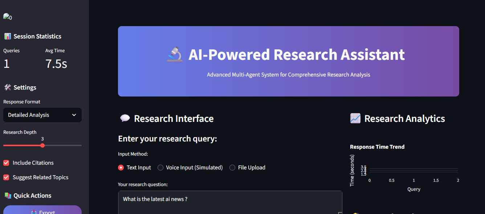
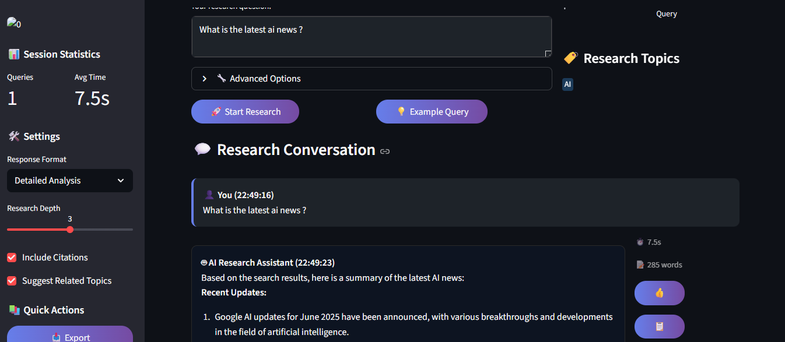
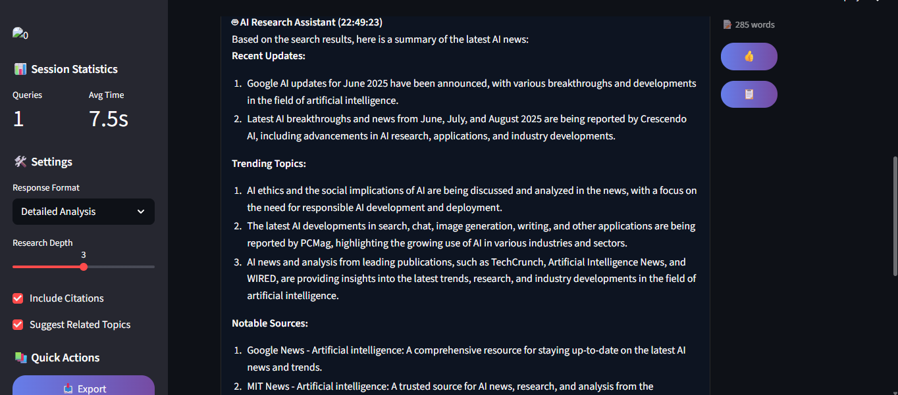

# Multi-Agent Research Summary System 🤖📚

Welcome to the **Multi-Agent Research Summary System**, a modular AI project built using the LangGraph framework. 

This system demonstrates a powerful multi-agent workflow where specialized AI agents collaborate to research a topic, gather information from the web, and generate concise summaries. 

Perfect for exploring how multi-agent AI systems can work together to solve complex tasks! 🚀

---

### 🧩 Project Overview

This project orchestrates multiple AI agents using LangGraph's graph-based workflow:

- **Researcher Agent** 🔍  
  Responsible for performing web searches and gathering relevant information. Uses the DuckDuckGo search tool to fetch up-to-date data from the internet. It processes user queries and collects multiple snippets to feed the next agent.

- **Writer Agent** ✍️  
  Acts as a technical writer who receives the gathered information from the researcher agent and generates a clear, concise, and structured summary. It crafts the final output for the user based on the researched content.

- **Final Collector Node** 🧾  
  Aggregates the final response by extracting the relevant content from the writer agent's output and returns the final answer to the user.

---

### 🛠️ Core Components

### Agents

- Researcher Agent: Uses DuckDuckGo to perform web searches and gather relevant information based on the user's query.

- Writer Agent: Takes the information from the Researcher and generates a concise, well-structured summary.

- Final Collector Node: Extracts the final summarized answer from the Writer's messages and formats the response for delivery.

These agents work together to research, summarize, and deliver clear and informative answers.

### Tools

- **DuckDuckGo Search Tool** 🌐  
  Implements web search via the `ddgs` package (DuckDuckGo Search API) to fetch real-time information. The researcher agent uses this to access fresh knowledge from the internet without relying on paid APIs.

---

### ⚙️ How It Works

1. The user provides a query (e.g., "Summarize recent research on graph neural networks in multi-agent collaboration").

2. The **Researcher Agent** performs a DuckDuckGo search to collect relevant research papers, articles, and snippets.

3. The collected information is passed to the **Writer Agent**, which crafts a clear, concise summary.

4. The **Final Collector Node** extracts the summary text and returns it as the final output.

5. The system returns the polished summary to the user.

---

### 💡Example Queries to Test

- "Explain the Agent to Agent concept in AI Agents."

- "Summarize recent research on graph neural networks in multi-agent collaboration."

- "What are the latest developments in multi-agent reinforcement learning?"

- "Tell me about the Agent2Agent protocol by Microsoft."

### Results:

---

---

---

### 🎯 Why This Project?

- Demonstrates multi-agent AI collaboration using a graph-based workflow.

- Uses real-time web search to fetch fresh, relevant data.

- Showcases how specialized agents can delegate tasks efficiently.

- Builds a foundation for more complex AI systems like research assistants, customer support bots, or enterprise knowledge workflows.

---

Thank you for exploring the Multi-Agent Research Summary System! Feel free to contribute or raise issues. Happy coding! 🚀✨
